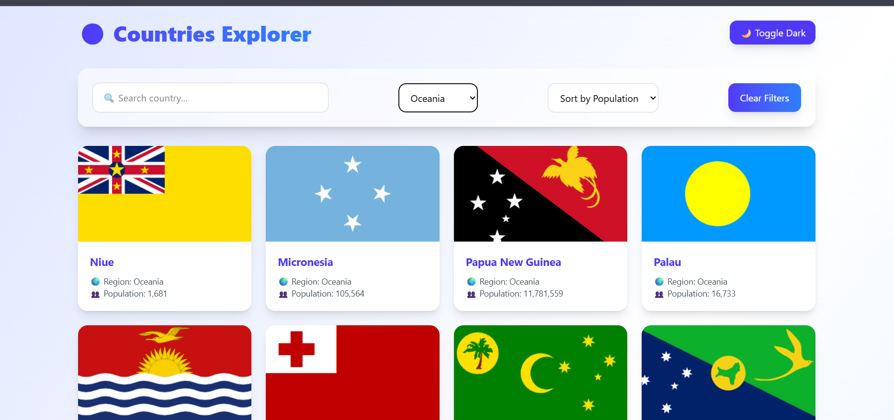

# 🌎 Countries Explorer

A modern Countries Explorer web app built with **React (Vite)** and **Tailwind CSS v4**.

This application fetches real country data from the REST Countries API and allows users to:

- 🔍 Search countries by name
- 🌍 Filter countries by region
- 📊 Sort countries by population
- 🌙 Toggle dark mode
- ❌ Clear filters
- ⚠️ Handle loading and error states properly

---

## 🚀 Live Features

- Real-time data fetching using `useEffect`
- Conditional rendering for loading & errors
- Responsive grid layout
- Glassmorphism UI design
- Smooth hover animations
- Dark mode support

---

## 🛠 Technologies Used

- React (Vite)
- Tailwind CSS v4
- REST Countries API

---

## 🌐 API Endpoints Used

All Countries:
https://restcountries.com/v3.1/all

Search by Name:
https://restcountries.com/v3.1/name/{name}

Filter by Region:
https://restcountries.com/v3.1/region/{region}

---

## 📦 Installation & Setup

1. Clone the repository:
   git clone https://github.com/zarifa1401/countries-explorer

2. Navigate into the project folder:
   cd countries-explorer

3. Install dependencies:
   npm install

4. Start development server:
   npm run dev

---

## 📸 Screenshots

### Home Page

### Search Results

---

## 📚 What I Learned

- Using `useEffect` with dependency arrays
- Fetching and handling API data
- Managing multiple states in React
- Handling loading and error states
- Conditional rendering
- Building responsive UI with Tailwind CSS v4

---

## ✨ Author

Zarifa Rahmani